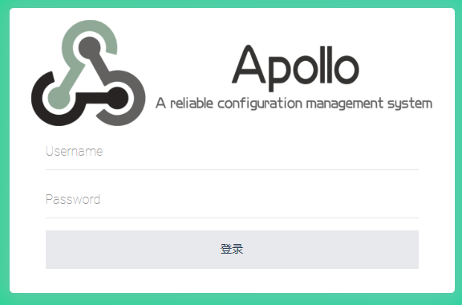
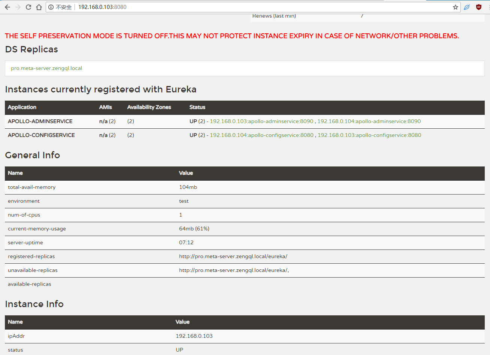

# 构建携程 Apollo Docker 镜像

Apollo(阿波罗)是携程框架部门研发的配置管理平台，拥有以下特性：
* 能够集中化管理应用不同环境、不同集群的配置
* 配置修改后能够实时推送到应用端
* 具备规范的权限、流程治理等特性。

使用以下语言及环境运行：
* 服务端基于Spring Boot和Spring Cloud开发，打包后直接运行
* Java客户端不依赖任何框架，运行于所有Java运行时环境，对Spring/Spring Boot环境也有较好的支持。
* .Net客户端不依赖任何框架，能够运行于所有.Net运行时环境(包括 .Net Core 哟)。

官方仓库地址：https://github.com/ctripcorp/apollo

## docker 部署 apollo(阿波罗) 配置中心，下面命令基于ubuntu 18.04.1版本执行

``` bash
# 由于我这里采用编译源码的方式，需要安装java，mvn环境
apt-get install openjdk-8-jdk
# 查看openjdk版本
java -version
#  安装oracle java jdk
# ubuntu16.04,请换成命令：apt-get install python-software-properties
apt --fix-broken install python-pycurl python-apt 
add-apt-repository ppa:webupd8team/java
apt-get update
apt-get install oracle-java8-installer
# 最后查看java版本
java -version
# 安装maven
apt-get install maven
# 查看版本
mvn -version
# 更换mvn源为阿里源(下面cd目录为上面版本中对应目录)
cd /usr/share/maven/conf
vim settings.xml
# 配置mirrors的子节点，添加如下mirror
```
``` xml
<mirror>  
    <id>nexus-aliyun</id>  
    <mirrorOf>central</mirrorOf>    
    <name>Nexus aliyun</name>  
    <url>http://maven.aliyun.com/nexus/content/groups/public</url>  
</mirror>
```
``` bash
# 切换回根目录，克隆 apollo 项目
cd
git clone https://github.com/ctripcorp/apollo.git
# 进入 apollo 目录,并切换到v1.0.0版本，此版本开始meta-server以及环境都可以通过环境变量指定了
cd apollo/
git checkout v1.0.0
# 导入sql脚本到mysql数据库(我这里是用windows系统的workbench导入的脚本文件：scripts/sql/apolloconfigdb.sql,scripts/sql/apolloportaldb.sql)
# 也可通过下面的命令(需要安装 mysql 客户端)：
mysql --user=root --password=123456 < scripts/sql/apolloconfigdb.sql
mysql --user=root --password=123456 -e "use ApolloConfigDB;show tables;"
mysql --user=root --password=123456 < scripts/sql/apolloportaldb.sql
mysql --user=root --password=123456 -e "use ApolloPortalDB;show tables;"
```
``` bash
# 执行编译打包
scripts/build.sh
# 打包完后，将apollo-configservice、apollo-adminservice、apollo-portal的target路径下apollo-{servicename}-{version}-github.zip分别复制到各自的src/main/docker目录
cp apollo-configservice/target/apollo-configservice-1.0.0-github.zip apollo-configservice/src/main/docker/apollo-configservice-1.0.0-github.zip
cp apollo-adminservice/target/apollo-adminservice-1.0.0-github.zip apollo-adminservice/src/main/docker/apollo-adminservice-1.0.0-github.zip
cp apollo-portal/target/apollo-portal-1.0.0-github.zip apollo-portal/src/main/docker/apollo-portal-1.0.0-github.zip
```

### 将docker镜像上传至阿里云

以上已编译镜像，避免下次使用或者放到其他服务器部署，我们可以将镜像上传只阿里云
``` bash
docker login --username=413210209@qq.com registry.cn-shenzhen.aliyuncs.com
docker tag apollo-adminservice:1.0.0 registry.cn-shenzhen.aliyuncs.com/zengql-release/apollo-adminservice:1.0.0
docker push registry.cn-shenzhen.aliyuncs.com/zengql-release/apollo-adminservice:1.0.0
docker tag apollo-configservice:1.0.0 registry.cn-shenzhen.aliyuncs.com/zengql-release/apollo-configservice:1.0.0
docker push registry.cn-shenzhen.aliyuncs.com/zengql-release/apollo-configservice:1.0.0
docker tag apollo-portal:1.0.0 registry.cn-shenzhen.aliyuncs.com/zengql-release/apollo-portal:1.0.0
docker push registry.cn-shenzhen.aliyuncs.com/zengql-release/apollo-portal:1.0.0
```

### 如何使用 Docker 镜像

#### 1. 配置运行环境，以部署在：192.168.0.103 为例

修改 ApolloConfigDB.ServerConfig 中的 eureka.service.url 值

ApolloPortalDB.ServerConfig 中的环境配置


#### 2. 运行 apollo-configservice 镜像

``` bash
docker run --name=apollo-configservice  --restart=always  --network=host
-v /opt/logs/100003171:/opt/logs/100003171
-e 'spring_datasource_url=jdbc:mysql://192.168.0.105:3306/ApolloConfigDB?characterEncoding=utf8'
-e 'spring_datasource_username=root'
-e 'spring_datasource_password=123456'
registry.cn-shenzhen.aliyuncs.com/zengql-release/apollo-configservice:1.0.0

# 心跳检测
curl http://192.168.0.103:8080/health
```

#### 3. 运行 apollo-adminservice 镜像

``` bash
docker run --name=apollo-adminservice  --restart=always  --network=host
-v /opt/logs/100003172:/opt/logs/100003172
-e 'spring_datasource_url=jdbc:mysql://192.168.0.105:3306/ApolloConfigDB?characterEncoding=utf8'
-e 'spring_datasource_username=root'
-e 'spring_datasource_password=123456'
registry.cn-shenzhen.aliyuncs.com/zengql-release/apollo-adminservice:1.0.0

# 心跳检测
curl http://192.168.0.103:8090/health
```

#### 4. 运行 apollo-portal 镜像

``` bash
docker run --name=apollo-portal  --restart=always  --network=host
-v /opt/logs/100003173:/opt/logs/100003173
-e 'spring_datasource_url=jdbc:mysql://192.168.0.105:3306/ApolloPortalDB?characterEncoding=utf8'
-e 'spring_datasource_username=root'
-e 'spring_datasource_password=123456'
registry.cn-shenzhen.aliyuncs.com/zengql-release/apollo-portal:1.0.0

# 心跳检测
curl http://192.168.0.103:8070/health
```

#### 5. 浏览器访问配置后台管理界面：http://192.168.0.103:8070



#### 6. Eureka 服务中心访问界面：http://192.168.0.103:8080

